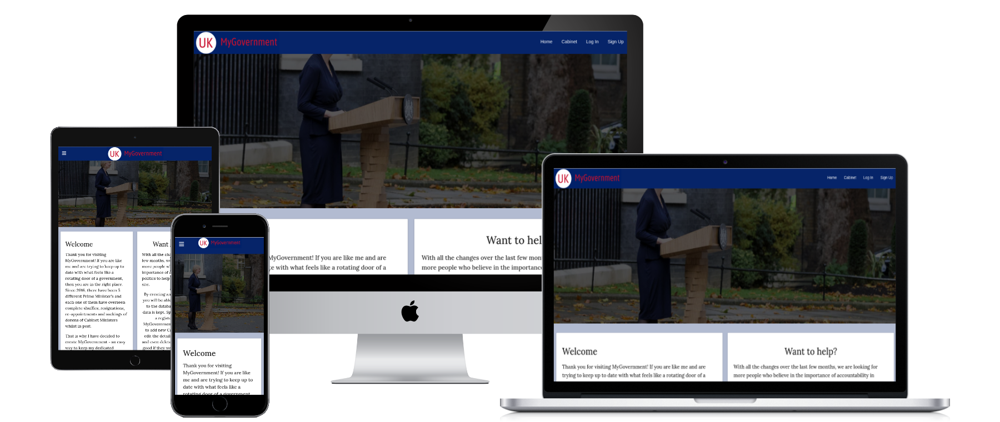

# MyGovernment README
Here is a link to the website [MyGovernment](https://my-uk-government.herokuapp.com/home)

## What is this ReadME for?
This is the ReadMe for the website My Government UK. My Government UK is a website built using HTML, CSS and Python and the supporting framework Flask which pulls its data from a MongoDB database so that the databases' data can be viewed in a user-friendly way. The site's fundamental goal is to educate people on which Members of Parliament (MPs) currently make up the UK Government.

## UX

### The Strategy Plane
* My inspiration for deciding to build this website came from the recent events in UK Politics. Since September 2022, the UK has had 3 different Prime Ministers (PMs) and with each change-over there have been dozens of sackings, re-appointments and new appointments of Cabinet Ministers - the team of the most senior ministers in the Government who are chosen by the Prime Minister to lead on specific policy areas such as Health, Transport, Foreign Affairs or Defence. With the vast number of changes in Government, I wanted to build a website where users can easily view who are currently the members of the cabinet who would be devising government policy on the most important areas that affects everyone's lives in the UK. Through increased awareness of who these individuals are, I aim to improve the accountability of those individuals and the overall government's outcome on the policies they have lead on.

#### Site Goals
* To provide users with an easy way of viewing the current UK Government and its members.
* To allow for users to create an account which will allow them to help them keep the website up-to-date by creating new records for any new additions to the Cabinet.
* To allow for registered users to edit existing records and also delete them too.
* To ensure that the site is fully accessible on desktop and touch screen devices.
* To ensure that the app is fully compliant with keyboard commands and screen readers.

#### User Stories
* As a user, I want to be able to view quickly who the current members of the cabinet are.
* As a user, I want to be able to view the cabinet members details, see a photo of them and know what positions they hold and also what constituency they represent.
* As a user, I want to be able to create an account so that I can help keep the database up to date, should there be any future changes to the cabinet.
* As a user I want to be able to use this site with my keyboard
* As a user I want to be able to use a screen reader to help use this site.
