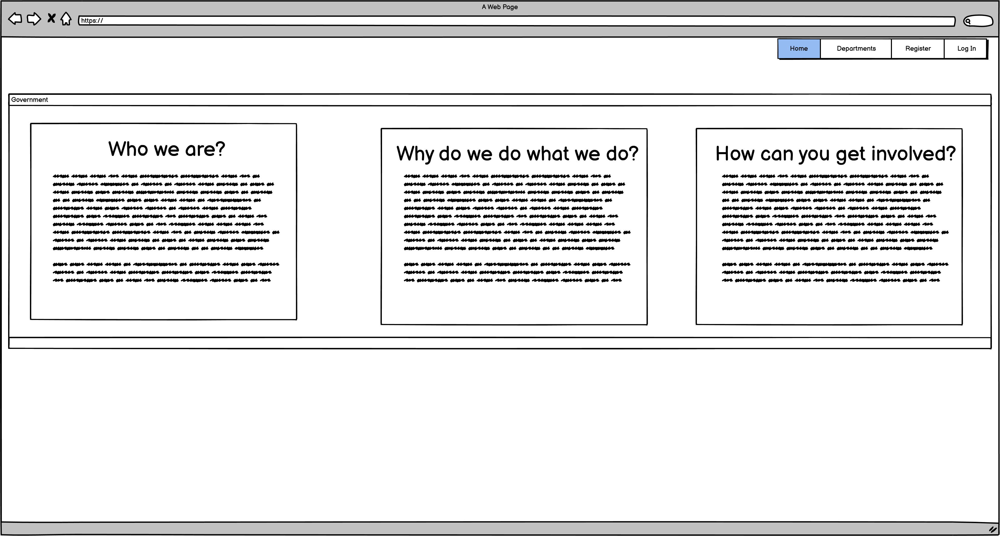
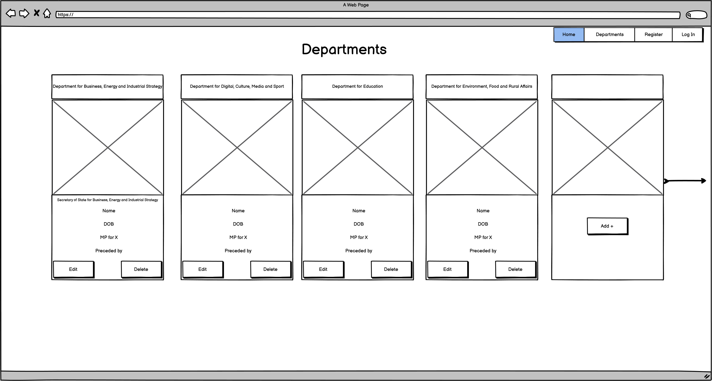

# MyGovernment README
Here is a link to the website [MyGovernment](https://my-uk-government.herokuapp.com/home)

## What is this ReadME for?
This is the ReadMe for the website My Government UK. My Government UK is a website built using HTML, CSS and Python and the supporting framework Flask which pulls its data from a MongoDB database so that the databases' data can be viewed in a user-friendly way. The site's fundamental goal is to educate people on which Members of Parliament (MPs) currently make up the UK Government.


## UX

### The Strategy Plane
* My inspiration for deciding to build this website came from the recent events in UK Politics. Since September 2022, the UK has had 3 different Prime Ministers (PMs) and with each change-over there have been dozens of sackings, re-appointments and new appointments of Cabinet Ministers - the team of the most senior ministers in the Government who are chosen by the Prime Minister to lead on specific policy areas such as Health, Transport, Foreign Affairs or Defence. With the vast number of changes in Government, I wanted to build a website where users can easily view who are currently the members of the cabinet who would be devising government policy on the most important areas that affects everyone's lives in the UK. Through increased awareness of who these individuals are, I aim to improve the accountability of those individuals and the overall government's outcome on the policies they have led on.


#### Site Goals
* To provide users with an easy way of viewing the current UK Government and its members.
* To allow for users to create an account which will allow them to help them keep the website up-to-date by creating new records for any new additions to the Cabinet.
* To allow for registered users to edit existing records and also delete them too.
* To ensure that the site is fully accessible on desktop and touch screen devices.
* To ensure that the app is fully compliant with keyboard commands and screen readers.

#### User Stories
* As a user, I want to be able to view quickly who the current members of the cabinet are.
* As a user, I want to be able to view the cabinet members details, see a photo of them and know what positions they hold and also what constituency they represent.
* As a user, I want to be able to create an account so that I can help keep the database up to date, should there be any future changes to the cabinet.
* As a user I want to be able to use this site with my keyboard
* As a user I want to be able to use a screen reader to help use this site.

### The Scope Plane
Features Planned
* A page which displays all of the cabinet members on one page with their details and an accompanying photograph.
* Responsive Design allowing the user to correctly operate the site across a range of devices the user could potentially use such as Desktop, Laptop, Tablet and Mobile's.
* An account creation system which meets standard password and account protections such as minimum characters length.
* Be able to Create, Read, Update and Delete data on the database through the website and have these changes reflect instantly on the website (CRUD Functionality)
* The site should be fully accessible for keyboard users
* The site should be fully accessible for screen reader users

### The Structure Plane
User Story:
> As a user, I want to be able to view who the current members of the cabinet are, see a photo of them and know what positions they hold and also what constituency they represent.

Acceptance Criteria:
* The user should be able to quickly find who the current cabinet members and view their details all in one place with just a few clicks.

Implementation:
* A profile card containing the cabinet member's name, image, position and constituency. 

User Story:
> As a user, I want to be able to find out more details such as a biography and recent voting records for a particular cabinet member.

Acceptance Criteria:
* Users should be able to click on a Cabinet Member to view further details about them.

Implementation:
* Use of Parliament API to obtain this up-to-date information for each cabinet member. 

User Story:
> As a user, I want to be able to create an account so that I can help keep the database up to date, should there be any future changes to the cabinet.

Acceptance Criteria:
* Users should have the ability to create accounts and when logged in be able to make changes to the database.

Implementation:
* It should be possible for a user to create an account which have some form of password controls like minimum lengths. Upon creating an account or logging in, the website should uncover additional functions to allow for CRUD functionality.

User Story:
> As a user, I want to be able to use this site with only my keyboard

Acceptance Criteria:
* It should be entirely possible for an individual utilising only a keyboard to be able to experience the full features of the site and navigate around with ease.

Implementation:
* The user will be able to navigate the site using only a keyboard. All buttons and images can be selected utilising both mouse clicks and "keydown" enter.

### The Skeleton Plane
#### Wireframes
I utilised Balsamiq to produce my wireframes of how the app would appear across different devices.

Mobile Device Wireframes 
 
 
 

Tablet Device Wireframes

 
 

Desktop Device Wireframes
 
 

 ### The Surface Plane

#### Design 
##### Colour Scheme
The colour scheme I opted to use represent the colours of the union jack. The Hex codes for the 3-colour flag were: White: #FFFFFF.Red: #C8102E.Blue: #062469. There is some variation across the pages to reduce the opacity to improve readability. 

##### Typography
I used the 'Times New Roman', font for title 'The Cabinet' with 'Times & sans-serif;' as the fallback font in case for any reason the font isn't being imported into the site correctly. I found 'Times New Roman' gave this page title a historical feeling which is meant to convey the ancientness of The UK Cabinet which was first formed 1644.

I used the font 'Poppins', with 'sans-serif' as the fallback, for the Cabinet Members role title and also on the cabinet members profile card as I thought this font had a strong and important look relative to the other fonts used. The information characterised within this font are considered to be the key information on the cabinet members i.e. their role, bio, and recent voting records. 'Poppins' was obtained from Google Fonts.

I used the font 'Catamaran', with 'sans-serif' as the fallback, for the Cabinet Members' Name as when trialling different fonts between the Role Title ('Poppins') and Constituency ('Lora') this font looked neat and clear. I also used for the titles and text on the forms as it again gave a clear and tidy visual. On the Delete Minister Form, the weight is increased in conjunction with the different coloured background to warn the user that this is the delete form to avoid accidental deletions of data. 'Catamaran' was obtained from Google Fonts.

I used the font 'lora', with 'sans-serif' as the fallback, for the cabinet members constituency as I felt this gave a softer and less prominent look than the fonts for their name and role. This is intentional as the constituency took less precedence over the cabinet position. 'Lora' was obtained from Google Fonts.

[Google Fonts](https://fonts.google.com/)

##### Imagery
The use of images is a key display feature of this website. I have used the MPs' official portrait photos that are freely accessible on [Parliament.UK](https://members.parliament.uk/member) in a 3x4 ratio. I had the issue of Rishi Sunak and Penny Mordaunt not having their official portrait available at this time on Parliament.UK so I used another portrait image for them which had a creative commons license.

For the Log In page, I have used a beautiful image of the Houses of Parliament at night with the River Thames in the foreground. This and 10 Downing Street are perhaps the most recognisable buildings in UK Politics so I felt it was fitting that it should be used here. I felt that this image compliments the dark colours used in the navbar and log of the website and overall creates a pretty looking log in page.

For the Sign up page, I have used a colourful image of the front door of 10 Downing Street. As already mentioned, this is a key building in UK Politics and it is also where The Cabinet meet and it is also the home of the Prime Minister and neighbour to the Chancellor (No11 Downing Street). Additionally, [Larry the Cat](https://en.wikipedia.org/wiki/Larry_(cat)) can be seen in the foreground of the image which is a subtle nod to the fact that Larry is officially the Chief Mouser to the Cabinet Office and has resided in Downing Street for longer than the last 5 Prime Ministers. Larry's presence alongside the colourful image is an invitation to the sites users to register an account with the website.

## Features
### UK Parliament API 
In addition to the information being displayed on the Cabinet.html page, I wanted to go a step further and provide some further details regarding the MPs. I found that there was an official free API for the UK Parliament which allowed me to request information on all the Cabinet Members. I decided to create a new page cabinet_member.html in order to display the details here. The code for this API functionality can be found in cabinet_member.js. When a user clicks on the portrait photo of a Cabinet Minister, that Cabinet Ministers unique page opens with all the information on the page pulled from the API. 

I found this API to be quite easy to use and I enjoyed working with it. 

[UK Parliament Members API](https://members-api.parliament.uk/index.html)


### Planned / Scrapped Features
I had further ideas for additional features for this application but, due to time constraints, these were not implemented.

I would have liked to have expanded the database to include additional cabinet attendees who are not deemed as Cabinet Ministers. Additionally, I would have liked to have added a filter option so that the user can show only a list of Cabinet members by a given condition - e.g. Age over 40, Ministers by Department, Gender etc.  

Further to this, I would have liked to expand the Cabinet_member.html page to obtain more details on the Cabinet Members from the API Calls. 

### Languages Used

-   [HTML5](https://en.wikipedia.org/wiki/HTML5)
-   [CSS3](https://en.wikipedia.org/wiki/Cascading_Style_Sheets)
-   [JavaScript](https://en.wikipedia.org/wiki/JavaScript)
-   [Python](https://en.wikipedia.org/wiki/Python_(programming_language))

### Frameworks, Libraries & Programs Used

-   [Materialize 1.0.0](https://materializecss.com/)
    - Materialize was used to assist with the responsiveness, styling and JavaScript components on the website
-   [Google Fonts:](https://fonts.google.com/)
    - Google fonts were used to import the 'Catamaran', 'Poppins' & 'Lora' - further details in Design > Typography section of this file.
-   [Font Awesome:](https://fontawesome.com/)
    - Font Awesome icons were used across the pages which acted as buttons to aid navigation for the user. The Font Awesome Icons themselves were also added for aesthetic and UX purposes.
-   [Flask:](https://flask.palletsprojects.com/en/2.2.x/)
    - The Flask framework was used to build this application and allowed for seamless templating and navigation across the apps various pages.
-   [MongoDB:](https://www.mongodb.com/)
    - The Non-Relational Database was hosted on MongoDB and its data is obtained through the use of PyMongo.

## Data Schema
  ### Users
  - username: String
  - password: String

  ### Cabinet 
  - first_name: String
  - last_name: String
  - role: String
  - constituency: String
  - profile_pic: String
  - no : Integer

## Testing 
### User Story Testing 
> User Story: 
"As a user, I want to be able to view who the current members of the cabinet are, see a photo of them and know what positions they hold and also what constituency they represent"

> Expected: 
Users should be able to view all cabinet members when on the /cabinet page, which can be accessed via the Navbar when "Cabinet" is clicked. Users should be able to view all cabinet members on this page on all screen sizes and their details should be legible. The information on the cabinet members should be legible.

> Testing:
I clicked on Cabinet in the Navbar and was directed to the Cabinet page. Through the use of the browser Developer tools I was able to test how this page and the cabinet profile cards rendered on a variety of different screen sizes.  

> Result - Success:
Having tested this page on a variety of different screen sizes, I found that cabinet profile cards, and all of the information in them, rendered neatly and legibly. On large screens, 4 Cabinet members fit on one line and this reduces as the screen size does until on small screens 1 cabinet member fits to one line.

> Fix:
N/A. 

> User Story:
"As a user, I want to be able to find out more details such as a biography and recent voting records for a particular cabinet member"

> Expected: 
Users should be able to select on a Cabinet Members photo in order to open their respective details page which will make a request to the Parliament API and then display the results in the page.

> Testing:
I tested each and every cabinet member by clicking on the Cabinet Members photo and opening their details page and observed the results with the Console open in order to check whether there were any errors with the API request.

> Result - Success:
The API request succeeded with displaying the requested information for every cabinet member and there were no errors in the console.

> Fix:
N/A. 

> User Story:
"As a user, I want to be able to create an account so that I can help keep the database up to date, should there be any future changes to the cabinet"

> Expected:
Users should be able to Create an account, log out of it and log back in and additionally access CRUD functionality in the way of Adding Cabinet Members, Editing existing Cabinet Members and Deleting Cabinet Members. 

> Testing: 
I clicked on "Sign Up" in the navbar to navigate to the sign up page. I created an account by entering a username I had not previously used and then tried to set a password of "123" checking to see if validation was working for the password field. I would then enter a valid password and create an account and check to see if I was redirected to the Home screen and that the "You are already logged in!" message was displaying under the "Want to help?" section. I would then navigate to the Cabinet Page and test out the CRUD functionality by creating a "Test" cabinet member by way of the Add Cabinet Member button which should be now viewable to me if I am logged in. After filling out the Add Cabinet Member form, I should see the new cabinet member created at the bottom of the list of cabinet members. I would look to edit their Constituency and Role within the cabinet by using the Edit Cabinet Form and then submitting it. I would then check to see if the updates have been reflected on the cabinet page and if they were, I would then proceed with Deleting the Test Cabinet Member by using the Delete button and confirming the deletion. On deletion, I would then log out of my account and then log back to ensure that log in and log out feature was working as intended.

> Result - Success:
All steps in the testing outlined above for this user story were successfully carried out with no issues.

> Fix:
N/A. 

> User Story:
"As a user, I want to be able to use this site with only my keyboard"

> Expected:
Users should be able to carry out all of the above User Stories through the use of only a Keyboard.

> Testing: 
I carried out the exact same tests as with the above User Stories but by only using Keyboard commands.

> Result - Failure:
1. The Add Cabinet Member Button would not respond on "Enter" keydown. 
2. The Cancel option on the Add Cabinet Member Form would not respond on "Enter" keydown.

> Fix:
1. Added JavaScript to allow for this button to work when "Enter" is pressed.
2. Changed Cancel from anchor tag to a button. 
Following these fixes, and a repeat of tests, it was confirmed that the site was fully functional for keyboard-only users.

### Site Testing by a 3rd Party 
Having tested all of the user stories myself, I devised a step-by-step guide which captures what any user to the site may try to achieve when visiting the site and instructed my partner to follow them and provide me feedback on her results. The steps were as follows:
1. Open the website - *check to see if all of the contents load successfully - this will be done on every subsequent page opened
2. Click on the "Sign Up!" button.
3. Create a new account and attempt to create one which does not meet the password minimum character requirements. Ensure log in directs back to the Home Page.
4. Check that the "You are already logged in!" flash message shows where the "Sign Up" and "Log In" buttons originally were. Click "Log Out". Check that the Log Out Flash Message shows and that this can be closed by clicking on the X icon.
5. Try to Sign up a new account using the same account name as the already created one to ensure that this does not accept a new account creation.
6. Click on the "Log In" page. Try logging in with incorrect account and password details to ensure this fails. Try again with correct Account Name and incorrect password. Ensure the same flash message appears so that it is not distinguishable whether the password or account name was wrong.
7. Log In correctly.
8. Click on "Cabinet". Check to see if the Edit and Delete Icons appear correctly. 
9. Add in a new Cabinet Member. Enter the form details and ensure that each input field meets their requirements and that no field can be left unpopulated other than Profile Picture (URL). After submitting the form, check that the new cabinet member shows at the bottom of the screen. 
10. Edit the details of the new Cabinet Member. Ensure that the updated details are reflected in the new Cabinet Members details. 
11. Delete the newly added Cabinet Member. 
12. Click on Rishi Sunak's Portrait to access his Cabinet_Member page. Check that the details from the API load onto the site correctly and that button to navigate back to the cabinet page works.
13. Click on the other Cabinet Members to check this works too.
14. Sign out. 
15. Check the Add Button and Edit & Icons appear and that the text instructing users to log in / sign up are shown at the top of the Cabinet page under the title The Cabinet. 
16. Repeat using only a Keyboard.

Having followed these steps, my partner confirmed that she had no issues with carrying this out.

### Validator Testing
* HTML
    *   [W3C Validator](https://validator.w3.org/nu/)
        * No major issues in HTML files.
* CSS
    *   [Jigsaw Validator](https://jigsaw.w3.org/css-validator/#validate_by_input)
        * No issues in CSS files.
* JavaScript
    *   [JSlint Validator](https://www.jslint.com/)
        * No major issues in JS files.
* Python
    *   [Python Validator] Pycodestyle in GitPod 
        * No issues in python files.


### Responsiveness
Vigorous testing was conducted throughout the development process to ensure that the site maintained responsiveness as more elements were added on. Using developer tools and adjusting screen dimensions, I have checked to ensure that all content displays clearly over a variety of screen sizes - primarily on the Mobile, Tablet and Monitors. As mentioned above, media queries were added to correct responsiveness failings from Materialize. 

### Known Bugs
- No known bugs at this time.

## Deployment 
### Forking the GitHub Repository

By forking the GitHub Repository you can make a copy of the original repository on your GitHub account to view and/or make changes without affecting the original repository. This can be done by following these steps below:

1. Log in to GitHub and locate the [GitHub
   Repository](https://github.com/alikariminik/MyGov-Milestone-Project-3)
2. At the top of the Repository (not top of page) just above the "Settings"
   Button on the menu, locate the "Fork" Button.
3. Click the button (not the number to the right) and you should now have a copy
   of the original repository in your GitHub account.

### Making a Local Clone

1. Log in to GitHub and locate the [GitHub Repository](https://github.com/alikariminik/MyGov-Milestone-Project-3).
2. Under the repository name, click "Code".
3. To clone the repository using HTTPS, under "HTTPS", copy the link.
4. Open your local terminal with git installed
5. Change the current working directory to the location where you want the cloned directory to be created.
6. Type `git clone`, and then paste the URL you copied in Step 3.

    ```Terminal
    ~$ git clone https://github.com/alikariminik/MyGov-Milestone-Project-3.git
    ```

7. Press Enter. Your local clone will be created.

    ```Terminal
    $ git clone https://github.com/alikariminik/MyGov-Milestone-Project-3.git
    ```

### Deploying with Heroku
* The site was deployed to Heroku and automatic updates to the code were done through enabling automatic deploys from GitHub. The steps to deploy the site are as follows:
1. Log in to [Heroku](https://www.heroku.com/) and  navigate to your personal app dashboard.
2. At the top of the page locate the 'New' drop down, click it and then select 'Create new app'.
3. Give your application a unique name, select the nearest region to your location and click the 'Create app' button.
4. From the menu towards the top of the page select the 'Settings' section and click on 'Reveal Config Vars' in the Config vars section. Add in the Key:Value pairings for environment variables that are required for this app:
- `IP` = 0.0.0.0
- `PORT` = 5000
- `MONGO_DBNAME` = [Mongo DataBase Name]
- `MONGO_URI` = [Mongo DataBase URI]
- `SECRET_KEY` = [Secret Key]

5. Click on the Deploy tab and then under Deployment method, select GitHub.
6. Search and select the MyGov-Milestone-Project-3 repository.
7. Select Enable Automatic Deploys
8. Select Master Branch and then Click on Deploy Branch.

## Credits
#### Resources 
- Code Institute course material
- Code Institute Mentor
- [CodeInstitute-ReadME](https://github.com/Code-Institute-Solutions/SampleREADME)

#### Code
- In the app.py file, the code for Login, Registration and Log Out have been adapted for use from the CodeInstitute lessons which provide a walkthrough on how to create an account with the aid of Werkzeug. This is mentioned in the comments on this file on Lines 34, 60 & 89.

#### Media 
- [HeroImage:PrimeMinisterLizTrussResigns] https://www.flickr.com/photos/number10gov/52441645784/in/faves-196955694@N02/ Number 10 Flickr account
- [LogIn-Background] https://www.flickr.com/photos/97044050@N00/2706292588/ Maurice Flickr
- [SignUp-Background:LarrytheCatsitsunderUkraineFlowerArch] https://www.flickr.com/photos/number10gov/52308010218/in/photolist-2k3f4ae-2kAdvtn-2ifDpAY-MRHP1y-buuiMp-2nGbpXN-aVp57B-2nG4ZdS-pj2tNH-bgYUGT-2ihBerq-2kjHYFF-2qQgHL-2vQBzS-2nGhe49-2kjJvrK-2kjJvvx-2vHcXK-2ihAbcA-2keYMyc-2j4jdz-2ehhMp5-RBRbaB-bwDNEF-2mLwkdY-6bJP4R-wvdMjv-2jGShph-2dZkEuR-2fiAhrJ-2ehhMGQ-2ehhMyd-2ehhMuf-RBRb3T-2dZm37t-a21xic-2foejET-24LFpbn-Tf1Nfw-RBRb2R-RBRaZX-2ehh8SG-2ejA9UU-Tf2bi9-2foetba-2dZm38F-2jkSxhi-2jGRrTZ-2jGRsL5-8WMfFE Number 10 Flickr account
- [RishiSunakPortrait:OfficialportraitofRishiSunak] https://upload.wikimedia.org/wikipedia/commons/thumb/b/bc/Official_portrait_of_Rishi_Sunak_crop_2.jpg/360px-Official_portrait_of_Rishi_Sunak_crop_2.jpg Chris McAndrew 
- [PennyMordauntPortrait:OfficialportraitofPennyMordaunt] Chris McAndrew 
- All other Cabinet Member Portraits were obtained from https://members.parliament.uk/members/Commons